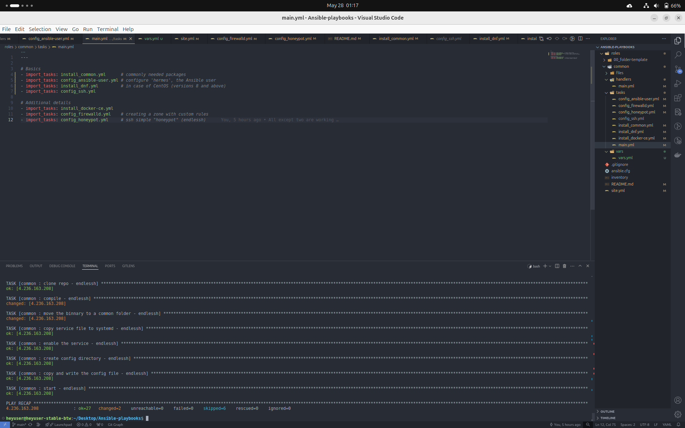

# Ansible-server-automation
Ansible automations for a quick configuration and maintenance of a CentOS server.

<!-- TABLE OF CONTENTS -->
<details>
  <summary>Table of Contents</summary>
  <ol>
    <li>
      <a href="#about-the-project">About The Project</a>
    </li>
    <li>
      <a href="#getting-started">Getting Started</a>
      <ul>
        <li><a href="#Pre-requisites">Pre-requisites</a></li>
        <li><a href="#How-to-run">How to run</a></li>
      </ul>
    </li>
    <li><a href="#folder-structure">Folder Structure</a></li>
    <li><a href="#results">Results</a></li>
    <li><a href="#what-i-learned-until-now">What I learned until now!</a></li>
  </ol>
</details>

## About the project
Ansible playbooks and taskbooks for a CentOS server configuration and maintenance.
- In a ⚡breeze⚡, you can give your server:
    - SSH honeypot 
    - Docker-CE
    - Firewall basic configuration
    - SSH settings configuration
    - Unix user for Ansible

Feel free to customize to your needs!
Want to test yourself the power of Infrastructure as Code? Keep reading! 🚀


## Getting started 
### Pre-requisites
- Linux server (CentOS, sometimes Ubuntu is supported too)
- <a href="https://docs.ansible.com/ansible/latest/installation_guide/intro_installation.html">Ansible</a> 
- SSH client (OpenSSH was the used one, on the target and host machines)
  
### How to run 
1. Get the playbooks and taskbooks
```zsh
git clone https://github.com/axelcarapinha/Ansible-automations.git && cd Ansible-automations
```
2. Define the target hostnames / IP addresses  (_inventory_ file)
3. Establish an SSH connection from the host machine to the servers
4. Create Ansible's keys:
```sh
cd ~/.ssh
ssh-keygen -t ed25519 -C 'ansible'
```
5. Place the public key on the target nodes:
```sh
# Option 1 (recommended)
ssh-copy-id -i path/to/key username@server_ip_or_hostname

# Option 2 
sudo nano ~/.ssh/authorized_keys
# paste the key mannualy in some line
```
Please, keep the private key safe on the host machine!

6. Edit the path to the Ansible keys:
```sh
# PRIVATE key path
nano ansible.cfg

# Public key
nano roles/common/tasks/config_ansible-user.yml
```
7. Choose what to use, run and enjoy! :)
```sh
nano roles/common/tasks/main.yml # Commented taskbooks will NOT be used (OPTIONAL)
ansible-playbook -u username_from_usual_ssh site.yml # NOT the Ansible user, for now
```
_Sidenote_: after the first run, you only need `ansible-playbook site.yml`

## Folder Structure
```sh
.
├── ansible.cfg
├── inventory
├── README.md
├── results.png
├── roles
│   ├── 00_folder-template
│   │   ├── defaults
│   │   ├── files
│   │   ├── handlers
│   │   ├── meta
│   │   ├── tasks
│   │   │   └── main.yml
│   │   ├── templates
│   │   └── vars
│   │       ├── defaults
│   │       ├── files
│   │       ├── handlers
│   │       ├── meta
│   │       ├── tasks
│   │       └── templates
│   └── common
│       ├── files
│       │   └── sudoer_hermes
│       ├── handlers
│       │   └── main.yml
│       ├── tasks
│       │   ├── config_ansible-user.yml
│       │   ├── config_firewalld.yml
│       │   ├── config_honeypot.yml
│       │   ├── config_ssh.yml
│       │   ├── install_common.yml
│       │   ├── install_dnf.yml
│       │   ├── install_docker-ce.yml
│       │   └── main.yml
│       └── vars
│           └── vars.yml
└── site.yml
```

## Results


## What I learned until now!
Had fun knowing more about:
- Ansible
  - playbooks
  - roles
  - taskbooks
  - tags
  - good Ansible practices
  - Ansible loops
  - difference between _import_ and _include_
- Advantages of Infrastructure as Code
  - eased, consistent and predictable server configuration
  - unnified approach to cloud environments
  - eased maintenance and version control (less information security threats)
  - managing settings of network devices (routers, in this case)
- Information Security
  - (simple) honeypots 
  - iptables, nftables, firewalld and ufw (differences)
  - firewalld (using) and its "zones"

However, an interesting lesson I learned: code abstractions can be a double-edged sword, due to the absence of knowledge about the underlying functions that may lead to a misuse of the final product (Ansible, in this case). Nothing that a deeper dive does not solve, anyways!
